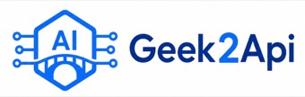

# XAiWebHook

| 赞助商 | 说明 |
| --- | --- |
| <a href="https://www.geek2api.com/?utm_source=fuckclaude&utm_medium=sponsor"></a> | 感谢 [Geek2API](https://www.geek2api.com/?utm_source=fuckclaude&utm_medium=sponsor) 赞助本项目。 |

XAiWebHook 是一个 mirai-console Kotlin 插件，通过 `webhook_config.yml` 配置双向 WebHook：

- Incoming：外部 HTTP 请求触发群/好友消息、HTTP 转发、网页截图或自定义响应。
- Outgoing：群聊和好友消息按规则匹配后执行动作。
- 模板：支持 `${request...}`、`${event...}`、默认值和基础布尔条件。
- 管理：支持 `/xwebhook reload` 与 `/xwebhook status`。

## 快速开始

### 环境要求

- JDK 11。
- mirai-console 2.16.0。
- 网页截图需要 Microsoft Edge、Chrome 或已安装的 Playwright 浏览器。

### 构建与安装

```bash
# Windows
./gradlew.bat buildPlugin

# Linux / macOS
./gradlew buildPlugin
```

插件包生成于：

```text
build/mirai/XAiWebHook-0.2.0.mirai2.jar
```

将 JAR 放入 mirai-console 的 `plugins/` 目录并启动。首次加载会生成：

```text
<mirai 根目录>/config/kim.hhhhhy.x.webhook/webhook_config.yml
```

修改配置后执行：

```text
/xwebhook reload
/xwebhook status
```

运行时配置不会因升级 JAR 自动覆盖。新增配置项或示例变更需要手工同步。

### 浏览器安装

Windows 示例默认复用系统 Edge。没有可用 Chrome/Edge 时可安装 Playwright Chromium：

```bash
./gradlew.bat playwrightInstallChromium
```

插件运行时不会自动下载浏览器。

## 配置入口

- 默认配置与完整注释：[src/main/resources/webhook_config.yml](src/main/resources/webhook_config.yml)
- Geek2Api 公共状态页：[examples/webhook_config.geek2api-status.yml](examples/webhook_config.geek2api-status.yml)
- Geek2Api CLI Bridge 登录：[examples/webhook_config.geek2api-cli-bridge.yml](examples/webhook_config.geek2api-cli-bridge.yml)
- CLI Bridge 协议与安全说明：[docs/CLI_BRIDGE_DESKTOP_INTEGRATION.md](docs/CLI_BRIDGE_DESKTOP_INTEGRATION.md)

启用配置前至少需要：

1. 替换 `change-me-token` 或 `change-me-incoming-token`。
2. 替换示例群号、好友号和发送者 QQ。
3. 只启用实际使用的 endpoint、route 和 action。
4. 确认 `browser.allowed_hosts` 只包含必要域名。

## Geek2Api 公共状态截图

公共 `/status` 页面无需 Geek2Api 账号或 Access Token。完整示例已经配置：

- `hk → hk2 → hk3 → hk4 → hk5` 五个入口自动 failover。
- 等待端点测速及渠道卡片或合法空状态加载。
- 截取完整 `//*[@id="app"]/div[2]/main`。
- 截图时隐藏 fixed header：`#app header`。
- 保留 `monitor-status` part ID，供浏览器查询 API 复用。

核心配置：

```yaml
browser:
  enabled: true
  engine: "chromium"
  channel: "msedge"
  headless: true
  session_cache_enabled: false
  allowed_hosts:
    - "hk.geek2api.com"
    - "hk2.geek2api.com"
    - "hk3.geek2api.com"
    - "hk4.geek2api.com"
    - "hk5.geek2api.com"

actions:
  geek2api-monitor-screenshot:
    type: "send_webpage_screenshot"
    enabled: true
    base_urls:
      - "https://hk.geek2api.com"
      - "https://hk2.geek2api.com"
      - "https://hk3.geek2api.com"
      - "https://hk4.geek2api.com"
      - "https://hk5.geek2api.com"
    group_id: "${request.body.group_id}"
    friend_id: "${request.body.friend_id}"
    screenshot:
      parts:
        - id: "monitor-status"
          url: "https://hk.geek2api.com/status"
          wait_until: "commit"
          steps:
            - op: "wait"
              selector: '//*[@id="app"]/div[2]/main/section[2]/div[2]/div[1]/button'
              state: "visible"
              timeout_ms: 60000
            - op: "wait"
              selector: '(//*[@id="app"]/div[2]/main/div/div/div/button[1] | //*[@id="app"]/div[2]/main//div[contains(concat(" ", normalize-space(@class), " "), " empty-state ")])[1]'
              state: "visible"
              timeout_ms: 60000
          selector: '//*[@id="app"]/div[2]/main'
      delay_before_ms: 3000
      timeout_ms: 60000
      font_wait_timeout_ms: 3000
      hide_selectors: ["#app header"]
      retry:
        enabled: true
        max_retries: 2
        delay_ms: 1000
```

通过 outgoing 触发时，截图会自动发回当前群或好友。通过 incoming 触发时，请求体必须提供 `group_id` 或 `friend_id`，且不能同时提供两者。

## Incoming 示例

```yaml
server:
  enabled: true
  host: "127.0.0.1"
  port: 18080
  base_path: "/webhook"

auth:
  type: "bearer"
  tokens: ["change-me-token"]
  allow_empty_for_localhost: false

incoming:
  endpoints:
    - id: "send-group"
      method: "POST"
      path: "/send-group"
      actions:
        - type: "send_group_message"
          group_id: "${request.body.group_id}"
          message: "${request.body.message ?: \"\"}"
        - type: "reply"
          status: 200
          body:
            success: true
```

调用示例：

```bash
curl -X POST http://127.0.0.1:18080/webhook/send-group \
  -H "Authorization: Bearer change-me-token" \
  -H "Content-Type: application/json" \
  -d '{"group_id":123456789,"message":"hello"}'
```

端点自己的 `tokens` 为空时会回退到全局 `auth.tokens`。常见状态码：`401` 鉴权失败、`404` 路径或方法不匹配、`409` 动作组忙、`413` 请求体过大、`500` 动作失败。

## Outgoing 示例

```yaml
outgoing:
  routes:
    - id: "group-message-forward"
      enabled: true
      events: ["group_message"]
      groups: [123456789]
      message:
        contains: ["关键词"]
      actions:
        - type: "http_request"
          method: "POST"
          url: "https://example.invalid/webhook"
          body:
            group_id: "${event.groupId}"
            sender_id: "${event.senderId}"
            message: "${event.messageText}"
```

`events`、`groups`、`friends`、`senders`、`message` 和 `condition` 之间是“与”关系；`message` 内的 `contains`、`starts_with`、`ends_with`、`regex` 之间是“或”关系。

## 核心配置速查

| 区块 | 用途 |
| --- | --- |
| `server` | HTTP 服务地址、端口和路径前缀 |
| `auth` | Incoming Bearer Token 鉴权 |
| `templates` | 模板表达式开关与缺失变量策略 |
| `browser` | 浏览器、超时、白名单和会话缓存 |
| `incoming.endpoints` | 外部请求入口 |
| `outgoing.routes` | mirai 消息事件匹配规则 |
| `actions` | 可复用命名动作 |
| `security` | 请求体和命令执行安全开关 |
| `logging` | 请求、响应和错误日志 |

支持的动作：

| 动作 | 说明 |
| --- | --- |
| `send_group_message` | 发送群消息 |
| `send_friend_message` | 发送好友消息 |
| `http_request` | 发起 HTTP 请求 |
| `send_webpage_screenshot` | 使用 Playwright 截图并发送图片 |
| `reply` | 构造 Incoming HTTP 响应 |
| `execute_command` | 执行 mirai-console 命令，默认禁用 |

动作可内联，也可在顶层 `actions` 命名后通过 `ref` 引用：

```yaml
actions:
  notify-admin:
    type: "send_group_message"
    group_id: 123456789
    message: "收到 WebHook"

incoming:
  endpoints:
    - id: "notify"
      actions:
        - ref: "notify-admin"
```

## 模板表达式

常用上下文：

- Incoming：`request.method`、`request.path`、`request.query.*`、`request.headers.*`、`request.body.*`、`request.remoteHost`。
- Outgoing：`event.type`、`event.botId`、`event.groupId`、`event.friendId`、`event.senderId`、`event.senderName`、`event.messageText`、`event.timestamp`。
- 冷却提示：`cooldown.routeId`、`cooldown.scope`、`cooldown.remainingMillis`、`cooldown.remainingSeconds`。

```yaml
message: "${request.body.message ?: \"默认内容\"}"
condition: "contains(${event.messageText}, \"紧急\") && ${event.senderId} != 10000"
```

表达式只支持变量替换、默认值、比较、布尔逻辑以及 `contains`、`startsWith`、`endsWith`，不执行任意脚本。

## 单飞与冷却

`single_flight` 防止同一动作组并发执行。多个入口使用相同 `key` 时共享一把锁：

```yaml
single_flight:
  enabled: true
  key: "geek2api-monitor-screenshot"
  notify: true
  message: "截图任务正在执行，请稍后再试。"
```

Outgoing `cooldown` 支持个人、管理员和路由全局冷却：

```yaml
cooldown:
  enabled: true
  personal_ms: 60000
  administrator_ms: 10000
  global_ms: 5000
  notify: true
  message: "请在 ${cooldown.remainingSeconds} 秒后重试。"
```

冷却和单飞状态只保存在内存中。管理员绕过权限为 `kim.hhhhhy.x.webhook:cooldown-bypass`。

## 命令与权限

| 命令 | 说明 |
| --- | --- |
| `/xwebhook reload` | 重载 YAML 并重启 WebHook 服务 |
| `/xwebhook status` | 查看服务、路由、浏览器和最近错误 |

主要权限：

- `kim.hhhhhy.x.webhook:admin`
- `kim.hhhhhy.x.webhook:execute-command`
- `kim.hhhhhy.x.webhook:cooldown-bypass`

`execute_command` 必须同时开启 `security.allow_command_execution: true` 和动作自身 `enabled: true`。

## 高级能力

### 受保护页面登录

访问 `/keys`、`/monitor` 等受保护页面时，可使用 CLI Bridge、账号密码兼容模式或静态 Token。推荐阅读：

- [CLI Bridge 完整示例](examples/webhook_config.geek2api-cli-bridge.yml)
- [CLI Bridge 协议与安全说明](docs/CLI_BRIDGE_DESKTOP_INTEGRATION.md)

启用 `browser.session_cache_enabled` 会把 token pair、Cookie 和 localStorage 写入磁盘。缓存目录必须限制访问权限。

### 浏览器文本查询 API

依赖插件可通过 `kim.hhhhhy.x.webhook.api.XAiWebHookBrowserApi` 复用命名截图动作的导航、认证和 BrowserContext。API 只接收 action、part 和受限 selector，不接收任意 JavaScript、Cookie 或 Token。

公共状态动作的兼容 part ID 为 `monitor-status`。

## 安全边界

- 生产环境必须替换示例 Token。
- 默认监听 `127.0.0.1`；绑定 `0.0.0.0` 时必须启用强 Token。
- `allow_empty_for_localhost` 只应在回环监听地址使用。
- `browser.allowed_hosts` 只配置必要域名。
- 不要在 YAML 或日志中暴露真实密码、TOTP、Token、Cookie 或 session cache。
- `send_webpage_screenshot` 不支持任意 JavaScript。
- `execute_command` 默认双重关闭。
- 示例群号、好友号和 URL 必须使用占位符后再提交。

## 故障排查

- 服务未启动：执行 `/xwebhook status`，检查端口占用、Token 和配置解析错误。
- 请求返回 401：检查 `Authorization: Bearer <token>`。
- 请求返回 404：检查 `base_path + path` 和 HTTP method。
- 请求返回 409：同一 `single_flight.key` 的任务仍在执行。
- 请求返回 413：请求体超过 `security.max_body_bytes`。
- 网页截图失败：检查 `browser.enabled`、浏览器 channel/路径、`allowed_hosts`、URL 和 selector。
- 公共状态截图异常：确认 selector 为 `//*[@id="app"]/div[2]/main`，并配置 `hide_selectors: ["#app header"]`。
- 字体加载卡住：调低 `screenshot.font_wait_timeout_ms`；超时后会使用当前回退字体继续截图。
- 偶发导航或网络超时：启用 `screenshot.retry`；持续 selector 超时应修正页面就绪条件。
- CLI Bridge 失败：查看 [CLI Bridge 文档](docs/CLI_BRIDGE_DESKTOP_INTEGRATION.md) 中的错误处理。
- 配置修改未生效：执行 `/xwebhook reload`；环境变量变化需要重启 mirai-console。

## 开发验证

```bash
# 普通测试
./gradlew.bat test

# 真实 Edge 浏览器测试
XAI_WEBHOOK_BROWSER_IT=true ./gradlew.bat test --tests "kim.hhhhhy.x.webhook.action.WebPageScreenshotActionTest"

# 公共状态页真实截图测试
XAI_WEBHOOK_GEEK2API_STATUS_IT=true ./gradlew.bat test --tests "kim.hhhhhy.x.webhook.action.WebPageScreenshotActionTest.publicGeek2ApiStatusConfigurationCapturesMainWithoutHeaderWhenExplicitlyEnabled"

# 构建插件包
./gradlew.bat clean buildPlugin
```
